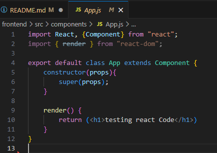

# Notes while doing this project
# Table of Contents

- [Django Setup](#Djago-Setup)
- [Files in Django Project](#Different-Files-in-a-Django-Project-Directory)
- [Files in Django App](#Different-Files-in-a-Django-APP)
- [React Setup](#React-Setup)
- [Cmds](#Some-cmds-related-to-this-project)
- [To Run Webpage](#To-run-webpage)
- [Basic explanation of how react works under the hood](#how-react-works-under-the-hood-with-django)

# Django Setup
``pip install django djangorestframework ``
### Starting a Django project
``django-admin startproject (project name)``
### Creating a Django App
 ``django-admin startapp (app name)``
- After we create an App , we need to add the app in our project's settings.py 


# Different Files in a Django Project Directory
### settings.py file
- Where all the configurations of the project are found
1. Installed app - If we create a new app , we need to add it in this file for the project to access it.
```python
    # Because we created 2 new apps called 'api' & 'rest_framework' , we need to add it into our project settings
    INSTALLED_APPS = [
    'django.contrib.admin',
    'django.contrib.auth',
    'django.contrib.contenttypes',
    'django.contrib.sessions',
    'django.contrib.messages',
    'django.contrib.staticfiles',
    'api.apps.ApiConfig',                   <====
    'rest_framework'                        <====
    ]
```


### urls.py file
- This file in our project directory slightly differs from other urls.py files . 
- This the the place where the webpage first enters to seek for endpoint pathways 
- We need to specify here where to send our webpage to 
```python
    # Used to send us to different APP/endpoints
    path('api/', include('api.urls'))

    # Extract the path to urls.py file in api APP
    # ( extracts the path of . => api file => urls.py )
    include('api.urls')
```

# Different Files in a Django APP

### views.py file
- Where we write all of our endpoints functions for the APP.

### urls.py file
- A place for us to execute a specific function when it reaches a certain endpoint
```python
    # Used to execute the main function when the endpoint is 'home'
    urlpatterns = [
    path('home', main),
    ]
```
### models.py file
- This like a database for our app (not 100% accurate)
- In Django ,instead of creating a table , we create a model
- Django allows us to write python code and it will intepret that python code and automatically perform database operations

### serializers.py file
- We can use Django's rest_framework to serialize our class and convert it into diff file formats for front end to understand (JSON files)

# React Setup
### Starting a React Frontend workspace
`npm init -y `

# Some cmds related to this project 
### Webpack
- Take all of our source Javascript files and compile/bundle it into one single Javascript file.

``npm i webpack webpack-cli ``
- Installing webpack 
### After we install webpack we need to setup the configs file


### Babel
- Take our code and transpile it into codes that is friendly with all different type of browsers (so that our newer version Javascript codes can be run on older browsers)

``npm i @babel/core babel-loader @babel/preset-env @babel/preset-react --save-dev``
- Installing babel

### After we install bable we need to setup the configs file


``npm install @babel/plugin-proposal-class-properties``
- Need this to use "async" & "await" in our Javascript Code

## React
``npm i react react-dom --save-dev``
- install react

``npm install react-router-dom``
- Allow us to rerout the pages so that we can go 2 diff pages from our react app

## Material-ui
- some built in components such as cards & grids that we can use. Kind of simillar to something like bootstrap

``npm install @material-ui/core``
- Install material_ui
- material_ui : some built in components 
- cards & grids that we can use
- kind of simmilar to something like bootstrap

``npm install @material-ui/icons``
- get icons from material ui

## Npm config - legacy-peer-deps
``npm config set legacy-peer-deps true``
- The concept of peer dependencies can cause challenges when installing packages. Consider the following scenario:

Package A requires Package B, and both have a common peer dependency, Package C. However, Package A requires Package C in version 1.x, while Package B requires Package C in version 2.x.

- When you try to install Package A and Package B together in your project, npm might encounter a conflict due to the different peer dependency versions required by each package. This can lead to installation failures, and it becomes challenging to resolve the conflicts manually.

- To alleviate the complications caused by conflicting peer dependencies, npm introduced the "legacy-peer-deps" configuration flag. When set to true, this flag instructs npm to revert to the older behavior of installing packages with peer dependencies.

# To run webpage
### 1. Inside of the music_player directory 
``python3 manage.py runserver``
- This runs the backend django server
### 2. Inside of the frontend directory 
``npm run dev``
- This runs the dev script inside of package.json file 


# How React works under the hood with django
1. When django sends us to the urls.py file inside of our frontend directory, we execute the index function when it reaches a endpoint called ''


2. The function index() executes a react function called render() that takes in 2 arguments
- render(request, path-to-html)
- Render will automatically look for templates in our template directory 
- Because we want it to render our frontend template , therefore we pass it the path to the html file in our templates directory which is : "frontend/index.html"


3. Before looking into the index.html , we first need to understand how webpack transpile all of our Javascript codes and bundle it into one single file.

4. Inside of webpack.config.js 
- We specified the entry point of our Javascript file as index.js inside of './src/'
- We also specified where our bundeled Javascript code will be stored - './static/frontend'


5. Webpack will first look into our specified entry point and compile all required Javascript codes mentioned in the entry Javascript file.

6. Now lets look into our specified Javascript entry point - index.js
- We import a self written component called 'App' inside of './components/App'
- And we make it replace 2 html div elements using this self written react component
- one with elementID = "app1" , another with elementID = "app2"


7. Notice that we imported a component called 'App' , now let's look at App.js
- constructor() - the constructor function of the App class
- super() - Because our App class inherits from Component , this is to call the default parent constructor (Component's constructor)
- render() - just a self written function 



8. Now , we can look into our index.html
- before executing this file , webpack will compile all the Javascript codes mentioned above , and bundle it into one called "bundle.js"
- The "script" tag at the end of the html file is used to executed bundle.js inside of 'static/frontend/bundle.js'
- bundle.js basically tells react to replace div components with id=app1 & app2 with our own App component (This instruction is being written in index.js)


9. This will be our end product
- React replacing both div elements

